# Autonomous WhatsApp Messaging — Complete Flow Documentation

> **No-Due Platform**  
> This document explains the end-to-end architecture of how WhatsApp messages are sent **autonomously** (without human intervention) to customers for payment reminders, and how customers can interact back.

---

## Table of Contents

1. [High-Level Architecture](#1-high-level-architecture)
2. [Connection & Onboarding (One-Time Setup)](#2-connection--onboarding-one-time-setup)
3. [Reminder Creation — How Messages Get Scheduled](#3-reminder-creation--how-messages-get-scheduled)
4. [The Autonomous Engine — Cron Job & processScheduledReminders](#4-the-autonomous-engine--cron-job--processscheduledreminders)
5. [Message Delivery — Meta Cloud API](#5-message-delivery--meta-cloud-api)
6. [Inbound Handling — When Customers Reply](#6-inbound-handling--when-customers-reply)
7. [Smart Throttling & Pause System](#7-smart-throttling--pause-system)
8. [Session Management](#8-session-management)
9. [Audit Trail & Real-Time Updates](#9-audit-trail--real-time-updates)
10. [Data Models](#10-data-models)
11. [Why It's Designed This Way](#11-why-its-designed-this-way)
12. [File Map](#12-file-map)

---

## 1. High-Level Architecture

```
┌─────────────────────────────────────────────────────────────────────┐
│                         NO-DUE PLATFORM                             │
│                                                                     │
│  ┌─────────────┐     ┌──────────────┐    ┌────────────────────────┐ │
│  │  Admin UI    │    │  Cron Job    │    │  Webhook Listener      │ │
│  │  (Frontend)  │    │  (1 min)     │    │  (POST /webhook)       │ │
│  └──────┬───────┘    └──────┬───────┘    └───────────┬────────────┘ │
│         │                   │                        │              │
│         ▼                   ▼                        ▼              │
│  ┌──────────────────────────────────────────────────────────────┐   │
│  │              REMINDER SERVICE (Core Brain)                   │   │
│  │  • createForDue()  → Schedules reminders from payment terms  │   │
│  │  • processScheduledReminders()  → Sends due messages         │   │
│  │  • createAfterDueReminders()  → Creates overdue reminders    │   │
│  │  • sendNow()  → Manual immediate send                        │   │
│  └───────────────────────────┬──────────────────────────────────┘   │
│                              │                                      │
│                              ▼                                      │
│  ┌──────────────────────────────────────────────────────────────┐   │
│  │              WHATSAPP SERVICE (API Layer)                    │   │
│  │  • sendTemplateMessage()  → Pre-approved templates           │   │
│  │  • sendInteractiveMessage()  → List menus                    │   │
│  │  • sendTextMessage()  → Free-form text                       │   │
│  └───────────────────────────┬──────────────────────────────────┘   │
│                              │                                      │
└──────────────────────────────┼──────────────────────────────────────┘
                               │
                               ▼
                    ┌─────────────────────┐
                    │  META CLOUD API     │
                    │  graph.facebook.com │
                    │  /v24.0             │
                    └──────────┬──────────┘
                               │
                               ▼
                    ┌─────────────────────┐
                    │  CUSTOMER'S         │
                    │  WHATSAPP           │
                    └─────────────────────┘
```

---

## 2. Connection & Onboarding (One-Time Setup)

Before any message can be sent, the **merchant** (business user) must connect their WhatsApp Business Account (WABA) to the platform. There are two methods:

### Method A: Embedded Signup (OAuth Flow)

**File:** `controller/whatsapp.controller.js` → `onboardBusiness()`

```
User clicks "Connect WhatsApp" in Admin UI
        │
        ▼
Frontend triggers Meta Embedded Signup dialog
        │
        ▼
User grants permissions → Returns `code` + `setupInfo`
        │
        ▼
POST /v1/whatsapp/onboard  { code, setupInfo }
        │
        ├── 1. Exchange code → Long-Lived Access Token
        ├── 2. Fetch Business Profile → Get WABA ID
        ├── 3. Fetch Phone Numbers → Get Phone Number ID
        ├── 4. Subscribe to Webhooks (so we receive inbound msgs)
        └── 5. Save to User document:
              user.whatsapp = {
                status: 'connected',
                setupStatus: 'COMPLETED',
                provider: 'meta',
                wabaId,
                phoneNumberId,
                accessToken,
                businessProfileId
              }
```

### Method B: Manual Connect

**File:** `controller/whatsapp.controller.js` → `manualConnect()`

The merchant provides `wabaId`, `phoneNumberId`, and `accessToken` directly. The system validates them against Meta's API before saving.

### Why Two Methods?

- **Embedded Signup** is the smooth UX path — guided by Meta's OAuth dialog.
- **Manual Connect** is a fallback for developers/power users who already have credentials from Meta Business Suite.

---

## 3. Reminder Creation — How Messages Get Scheduled

Reminders are **not** sent immediately when a due is created. Instead, they are **scheduled** as database records for future processing.

### 3.1 Automatic Scheduling (When a Due is Added)

**File:** `services/reminder.service.js` → `createForDue()`

```
New Due Added (Transaction with type "DUE_ADDED")
        │
        ▼
Fetch Customer → Populate PaymentTerm
        │
        ▼
PaymentTerm has `reminderOffsets` array  (e.g., [7, 3, 0])
        │
        ├── offset = 7 → Schedule 7 days BEFORE dueDate → type: "before_due"
        ├── offset = 3 → Schedule 3 days BEFORE dueDate → type: "before_due"
        └── offset = 0 → Schedule ON dueDate             → type: "due_today"
        │
        ▼
For each offset:
  scheduledFor = dueDate - offset days, set to 9:00 AM
  │
  ├── Skip if scheduledFor is in the past
  ├── Skip if identical reminder already exists (dedup check)
  └── Create Reminder document:
        {
          customerId, transactionId,
          reminderType: "before_due" | "due_today",
          whatsappTemplate: { name: "interactive_before_due1" | "interactive_due_today" },
          templateVariables: [customerName, amount, formattedDueDate],
          scheduledFor,
          status: "pending",
          source: "auto"
        }
```

### 3.2 Overdue Reminders

**File:** `services/reminder.service.js` → `createAfterDueReminders()`

This scans for all transactions where:

- `type === "DUE_ADDED"`
- `paymentStatus !== "PAID"`
- `dueDate < today`

For each overdue transaction without an existing `after_due` reminder, it creates one with `scheduledFor: now` and template `interactive_overdue`.

### 3.3 Manual / User-Scheduled Reminders

**Files:** `services/reminder.service.js` → `scheduleByUser()` and `sendNow()`

- **`scheduleByUser()`**: The admin picks a future date. The system automatically determines the template based on whether the date is before, on, or after the due date.
- **`sendNow()`**: Immediate send — creates a Reminder with `scheduledFor: now` and processes it inline.

### Why Schedule Instead of Send Immediately?

1. **Decoupling**: The creation of a due and the sending of a reminder are separate concerns.
2. **Retry-ability**: If sending fails, the record persists and can be retried.
3. **Auditability**: Every reminder attempt is tracked with status, timestamps, and error logs.
4. **Flexibility**: Reminders can be rescheduled, cancelled, or paused without touching the due itself.

---

## 4. The Autonomous Engine — Cron Job & processScheduledReminders

This is the **heart** of the autonomous system.

### 4.1 The Cron Job

**File:** `utils/cronJob/job.js`

```javascript
cron.schedule("*/1 * * * *", async () => {
  await reminderService.processScheduledReminders();
});
```

**Every 60 seconds**, the system wakes up and checks for reminders that need to be sent.

### 4.2 processScheduledReminders() — The Core Loop

**File:** `services/reminder.service.js` → `processScheduledReminders()`

```
CRON fires every 1 minute
        │
        ▼
Query: Find all Reminders where:
  • status IN ['pending', 'rescheduled']
  • scheduledFor <= NOW
  Populate: Transaction → Customer + Operator (company name)
        │
        ▼
FOR EACH reminder:
  │
  ├── 1. PAID CHECK:  Is transaction already paid?
  │     YES → Set reminder.status = "cancelled" → SKIP
  │
  ├── 2. PAUSE CHECK: Is tx.reminderPausedUntil > now?
  │     YES → Reschedule reminder to pausedUntil date → SKIP
  │
  ├── 3. COOLDOWN CHECK: canSendReminder()
  │     Was same reminderType sent for this transaction in last 24h?
  │     YES → SKIP (prevent spam)
  │
  ├── 4. CREDENTIALS: Fetch merchant WhatsApp credentials
  │     Customer → CustomerOfCompany (User) → user.whatsapp.accessToken
  │     Missing? → Log error, increment attempts → SKIP
  │
  ├── 5. TEMPLATE RESOLUTION:
  │     Check if merchant has custom template configured
  │     YES → Use merchant's custom template name
  │     NO  → Fall back to platform default template
  │
  ├── 6. BUILD PAYLOAD:
  │     Template variables: { name, amount, duedate, companyname }
  │
  ├── 7. SEND via Meta Cloud API:
  │     POST graph.facebook.com/v24.0/{phoneNumberId}/messages
  │
  ├── 8. SUCCESS:
  │     • reminder.status = "sent"
  │     • reminder.sentAt = now
  │     • Update customer.lastReminder = now
  │
  └── 9. FAILURE:
        • reminder.attempts += 1
        • reminder.lastError = error message
        (Stays as 'pending' → will be retried next cron cycle)
```

### Why a 1-Minute Interval?

- **Near real-time**: Messages go out within ~60 seconds of their scheduled time.
- **Low overhead**: One DB query per minute is negligible.
- **Batch processing**: Multiple reminders due at the same time are processed in one sweep.
- **Retry-friendly**: Failed reminders get a natural retry every minute.

---

## 5. Message Delivery — Meta Cloud API

### 5.1 Template Messages (Primary Method for Reminders)

**File:** `services/whatsapp.service.js` → `sendTemplateMessage()`

WhatsApp Business API requires **pre-approved templates** for proactive messages (messages sent outside the 24-hour customer-initiated window).

```javascript
POST https://graph.facebook.com/v24.0/{phoneNumberId}/messages
{
  messaging_product: "whatsapp",
  recipient_type: "individual",
  to: "919876543210",
  type: "template",
  template: {
    name: "interactive_before_due1",
    language: { code: "en" },
    components: [{
      type: "body",
      parameters: [
        { type: "text", text: "John", parameter_name: "name" },
        { type: "text", text: "5000", parameter_name: "amount" },
        { type: "text", text: "25 Feb 2026", parameter_name: "duedate" },
        { type: "text", text: "ABC Corp", parameter_name: "companyname" }
      ]
    }]
  }
}
```

### 5.2 Three Template Types

**File:** `utils/reminder.templates.js`

| Template Name             | When Used             | Purpose            |
| ------------------------- | --------------------- | ------------------ |
| `interactive_before_due1` | Days before due date  | Gentle reminder    |
| `interactive_due_today`   | On the due date       | Urgent nudge       |
| `interactive_overdue`     | After due date passed | Escalated reminder |

Each template supports **merchant customization**: merchants can configure their own template names per type through `user.whatsapp.reminderTemplates`. If not configured, platform defaults are used (fallback pattern).

### 5.3 Why Templates Instead of Free Text?

1. **Meta's Policy**: You **cannot** send free-text messages proactively. Templates must be submitted to and approved by Meta before use.
2. **Consistency**: Every customer gets a professional, well-formatted message.
3. **Compliance**: Templates are reviewed by Meta for spam/abuse, protecting the platform's reputation.
4. **Interactivity**: Templates can include buttons/lists for customer response (which this system uses).

---

## 6. Inbound Handling — When Customers Reply

The system doesn't just send — it **listens** and **reacts**.

### 6.1 Webhook Verification

**File:** `routes/whatsappWebhookRoutes.routes.js`

Meta sends a GET request to verify the webhook endpoint. The system responds with `hub.challenge` if the `hub.verify_token` matches.

### 6.2 Webhook Ingestion

```
META sends POST /webhook with message payload
        │
        ▼ (Immediately respond 200 to Meta)
        │
        ▼ (Process asynchronously)
whatsappWebhook(req.body)
        │
        ▼
handleWhatsappEvent(payload)   ← File: webhooks/whatsapp/whatsapp.handler.js
        │
        ├── STATUS UPDATE? (sent/delivered/read/failed)
        │     → whatsappAuditService.updateMessageStatus()
        │     → Updates WhatsappMessage record in DB
        │     → RETURN
        │
        ├── PARSE MESSAGE  ← whatsapp.parser.js
        │     TEXT message → { type: "TEXT", text, from }
        │     Interactive list_reply → { type: "LIST", actionId, from }
        │
        ├── FETCH MERCHANT CREDENTIALS
        │     Customer.findOne({ mobile }) → populate('CustomerOfCompany')
        │     → merchant.whatsapp.accessToken + phoneNumberId
        │
        ├── MARK AS READ (via Meta API)
        │
        ├── DEDUP CHECK: Block duplicate responses to same message
        │
        ├── AUDIT LOG: Save inbound message to WhatsappMessage collection
        │
        ├── UPDATE CUSTOMER: Set feedback + lastInteraction timestamp
        │
        └── ROUTE MESSAGE:
              │
              ├── TEXT "hi"/"hello" →
              │     Create/reset session → Send Interactive Main Menu
              │     Menu options: [CHECK_CURRENT_DUE]
              │
              └── LIST selection →
                    routeAction(intent)
                    │
                    ├── CHECK_CURRENT_DUE → Fetch customer.currentDue → Reply with amount
                    ├── PAY_TODAY / WILL_PAY_TODAY → Update commitment status, pause reminders 24h
                    ├── PAID_TODAY → Mark as paid-awaiting-confirmation, pause 7 days, notify merchant
                    ├── PAY_WEEK → Update commitment to this week, pause 7 days
                    ├── PAY_SOON → Pause reminders 72 hours
                    └── NEED_STATEMENT → Generate & send formatted payment statement
```

### 6.3 The Interactive Menu

**File:** `webhooks/whatsapp/whatsapp.template.js`

When a customer texts "Hi", they receive an interactive list message:

```
Welcome to No-Due! Please select an option below:

[Main Menu]
  └── Available Options
        └── "Current Due" — View my current outstanding dues
```

### Why This Matters

The customer **doesn't need to remember commands**. They get a structured menu. Their selection triggers a `list_reply` webhook back to the server, which is routed through `routeAction()`.

---

## 7. Smart Throttling & Pause System

The system has **multiple layers** to prevent message spam:

### 7.1 Cooldown Middleware

**File:** `middleware/reminderLimitMiddleware.js`

```javascript
canSendReminder({ transactionId, reminderType, cooldownMs = 24h })
```

Checks if a reminder of the **same type** was already sent for **the same transaction** within the last 24 hours. If yes → blocked.

### 7.2 Reminder Pause (Customer-Driven)

**File:** `services/due.service.js`

When a customer responds to a reminder via WhatsApp, the system **pauses future reminders** by setting `transaction.reminderPausedUntil`:

| Customer Action     | Pause Duration | Reason                         |
| ------------------- | -------------- | ------------------------------ |
| "I will pay today"  | 24 hours       | Give them time to pay          |
| "Paid today"        | 7 days         | Awaiting merchant confirmation |
| "Pay within a week" | 7 days         | Honor their commitment         |
| "Pay soon"          | 72 hours       | Grace period                   |
| "Need statement"    | 48 hours       | They need info first           |

During `processScheduledReminders()`, if `reminderPausedUntil > now`, the reminder is **rescheduled** to the pause-end date instead of being sent.

### 7.3 Paid Transaction Check

If the transaction is already marked `PAID`, the reminder is **cancelled permanently** (status → "cancelled").

### 7.4 Dedup on Creation

`createForDue()` checks for existing reminders with the same `transactionId + reminderType + scheduledFor` before creating new ones (compound unique index enforces this at DB level too).

### Why So Many Safety Layers?

1. **WhatsApp charges per message** — unnecessary messages cost real money.
2. **Customer experience** — nobody wants to be spammed, especially about payments.
3. **Meta's anti-spam policies** — too many complaints and the business number gets restricted/banned.
4. **Legal compliance** — payment reminders have regulatory implications in many jurisdictions.

---

## 8. Session Management

**Files:** `model/whatsappSession.model.js` + `services/whatsappSession.service.js`

Sessions track the **conversational state** of each customer on WhatsApp.

```
Session Schema:
{
  mobile: String (unique, indexed),
  state: String (default: "MAIN_MENU"),
  data: Object (arbitrary state data),
  lastActiveAt: Date,
  expiresAt: Date (TTL-indexed — MongoDB auto-deletes expired docs)
}
```

### TTL Behavior

- Default TTL: **1 minute** (configurable via `WHATSAPP_SESSION_TTL_MS`).
- MongoDB's TTL index on `expiresAt` **automatically** removes stale sessions.
- If a customer tries to interact with an expired session, they get: _"Due to inactivity, your session has timed out ⌛. Just type Hi to restart your conversation 👋"_

### Why Sessions?

WhatsApp conversations are stateless by default. Sessions allow the system to maintain context (e.g., knowing the customer selected "Check Current Due" vs. "Pay Today") across multiple message exchanges.

---

## 9. Audit Trail & Real-Time Updates

### 9.1 Message Audit

**File:** `services/whatsapp.audit.service.js`

Every message (inbound AND outbound) is logged:

```
WhatsappMessage {
  whatsappMessageId,  // Meta's message ID (wamid.xxx)
  mobile,
  direction: "INBOUND" | "OUTBOUND",
  type: "text" | "template" | "interactive" | ...,
  text,
  status: "queued" | "sent" | "delivered" | "read" | "failed" | "received",
  responseToMessageId,  // Links replies to original messages
  templateName,
  error,
  metadata,
  timestamp
}
```

**Status updates** from Meta (sent → delivered → read → failed) are captured via webhook and update the message record via `updateMessageStatus()`.

### 9.2 Conversation Tracking

**File:** `model/whatsappConversation.js`

Groups messages by customer mobile number:

```
WhatsappConversation {
  customerId: ObjectId → Customer,
  mobile,
  lastMessage,
  unreadCount,
  lastMessageAt
}
```

This powers the **admin chat list** — showing which conversations have unread messages.

### 9.3 Real-Time WebSocket Events

**Files:** `utils/whatsappmessage.js` + `socket/handlers.js`

When a new inbound message arrives:

```
io.to(`customer:${mobile}`).emit("new_message", { text, timestamp, mobile });
io.to(ownerId).emit("new_message_preview", { text, timestamp, mobile, unreadIncrement: 1 });
```

- `new_message` → Updates the open chat window in real-time.
- `new_message_preview` → Updates the chat list sidebar with unread badge.

The admin can also `mark_read` via socket to reset `unreadCount`.

---

## 10. Data Models

```mermaid
erDiagram
    User ||--o{ Customer : "owns (CustomerOfCompany)"
    User {
        ObjectId _id
        Object whatsapp "{ status, wabaId, phoneNumberId, accessToken, reminderTemplates }"
    }

    Customer ||--o{ Transaction : "has"
    Customer {
        ObjectId _id
        String name
        String mobile
        Number currentDue
        Date lastReminder
        String feedback
        Date lastInteraction
        ObjectId CustomerOfCompany "→ User"
        ObjectId paymentTerm "→ PaymentTerm"
    }

    Transaction ||--o{ Reminder : "triggers"
    Transaction {
        ObjectId _id
        String type "DUE_ADDED | PAYMENT"
        Number amount
        Date dueDate
        String paymentStatus "PENDING | PAID | PARTIAL | OVERDUE"
        String commitmentStatus
        Date reminderPausedUntil
        Date expectedPaymentDate
    }

    Reminder {
        ObjectId customerId "→ Customer"
        ObjectId transactionId "→ Transaction"
        String reminderType "before_due | due_today | after_due"
        Object whatsappTemplate "{ name, language }"
        Array templateVariables "[name, amount, dueDate]"
        Date scheduledFor
        Date sentAt
        String status "pending | sent | failed | cancelled | rescheduled"
        Number attempts
        String lastError
        String source "auto | manual"
    }

    WhatsappMessage {
        String whatsappMessageId
        String mobile
        String direction "INBOUND | OUTBOUND"
        String type
        String text
        String status
        String responseToMessageId
    }

    WhatsappConversation {
        ObjectId customerId "→ Customer"
        String mobile
        String lastMessage
        Number unreadCount
    }

    WhatsappSession {
        String mobile
        String state "MAIN_MENU | CHECK_CURRENT_DUE | ..."
        Date expiresAt "TTL auto-delete"
    }
```



---

## 11. Why It's Designed This Way

### Q: Why not send reminders directly when a due is created?

**A:** Separation of concerns. A due might be created weeks before the reminder should fire. Scheduling decouples "when to remind" from "what was owed." It also enables rescheduling, cancellation, and retry without modifying the original transaction.

### Q: Why a cron job instead of setTimeout/setInterval per reminder?

**A:** Cron jobs survive server restarts. `setTimeout` would lose all pending reminders if the server reboots. The database is the source of truth — the cron job simply queries it.

### Q: Why store credentials on the User document instead of using a central account?

**A:** This is a **multi-tenant SaaS**. Each merchant uses their own WhatsApp Business Account. Messages are sent _from the merchant's own number_, not a platform-wide number. This is critical for:

- Brand trust (customers see a number they recognize)
- Compliance (each merchant owns their messaging)
- Cost allocation (each merchant pays for their own Meta credits)

### Q: Why respond 200 immediately to webhooks before processing?

**A:** Meta requires a quick response. If the server takes too long, Meta will retry → duplicate messages. By responding 200 first and processing async (fire-and-forget), we prevent webhook retries while still handling the message.

### Q: Why separate WhatsappMessage, WhatsappConversation, AND Reminder models?

**A:**

- **Reminder**: Business logic (when/what/why to remind, scheduling, status)
- **WhatsappMessage**: Technical audit trail (every raw message sent/received via WhatsApp)
- **WhatsappConversation**: UX optimization (powers the admin chat list with unread counts)

Each serves a distinct purpose and would become unwieldy if merged.

### Q: Why use interactive list messages instead of plain text buttons?

**A:** WhatsApp Cloud API supports interactive messages (lists, buttons) natively. Lists allow **more than 3 options** (buttons are limited to 3). They also provide a structured `list_reply` webhook with a clean `actionId`, making routing deterministic.

---

## 12. File Map

| Layer           | File                                              | Purpose                                          |
| --------------- | ------------------------------------------------- | ------------------------------------------------ |
| **Entry Point** | `server.js`                                       | Imports and starts `jobForReminder()`            |
| **Cron**        | `utils/cronJob/job.js`                            | Runs `processScheduledReminders()` every 1 min   |
| **Service**     | `services/reminder.service.js`                    | Core brain: create, schedule, process, send      |
| **Service**     | `services/whatsapp.service.js`                    | Meta Cloud API wrapper (send, templates, OAuth)  |
| **Service**     | `services/whatsappSession.service.js`             | Session get/create/update with TTL               |
| **Service**     | `services/whatsapp.audit.service.js`              | Message logging and status tracking              |
| **Service**     | `services/due.service.js`                         | Customer response handling (pause/commitment)    |
| **Controller**  | `controller/whatsapp.controller.js`               | HTTP endpoints (onboard, reply, templates)       |
| **Webhook**     | `webhooks/whatsapp/whatsappwebhook.controller.js` | Webhook entry point                              |
| **Webhook**     | `webhooks/whatsapp/whatsapp.handler.js`           | Inbound message routing and processing           |
| **Webhook**     | `webhooks/whatsapp/whatsapp.parser.js`            | Raw payload → structured intent                  |
| **Webhook**     | `webhooks/whatsapp/whatsapp.template.js`          | Interactive menu builder                         |
| **Model**       | `model/reminder.model.js`                         | Reminder schema (scheduling, status, attempts)   |
| **Model**       | `model/whatsappMessage.modal.js`                  | Message audit log schema                         |
| **Model**       | `model/whatsappConversation.js`                   | Conversation list schema                         |
| **Model**       | `model/whatsappSession.model.js`                  | Session schema with TTL index                    |
| **Middleware**  | `middleware/reminderLimitMiddleware.js`           | 24h cooldown per reminder type                   |
| **Templates**   | `utils/reminder.templates.js`                     | Template resolution with merchant fallback       |
| **Utils**       | `utils/whatsappmessage.js`                        | Incoming message handler + WebSocket emitter     |
| **Routes**      | `routes/whatsapp.routes.js`                       | Authenticated API routes                         |
| **Routes**      | `routes/whatsappWebhookRoutes.routes.js`          | Public webhook routes (GET verify + POST)        |
| **Socket**      | `socket/handlers.js`                              | WebSocket event handlers (chat rooms, mark read) |

---

> **Summary**: The autonomous WhatsApp messaging system operates as a scheduled, event-driven pipeline. Dues create reminders → the cron job picks them up → Meta API delivers them → customer responses flow back via webhooks → the system intelligently pauses or escalates accordingly. Every step is logged, every message is tracked, and the entire flow requires zero human intervention after initial setup.
